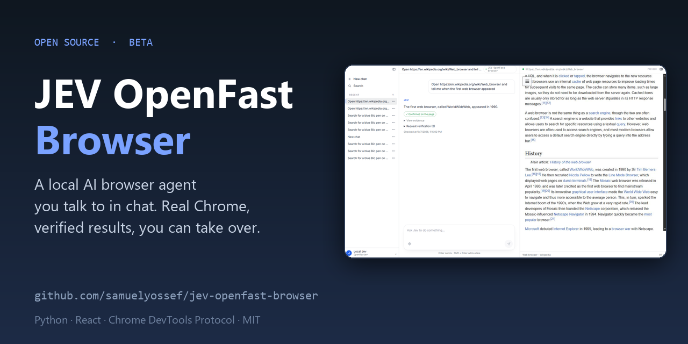

# JEV OpenFast Browser

[](https://github.com/samuelyossef/jev-openfast-browser/actions/workflows/ci.yml)
[](LICENSE)
[](pyproject.toml)

**A local AI browser agent you talk to in chat.** Describe a task ("find a blue pen on Amazon", "open this
article and tell me when it was published"); JEV opens a real Chrome tab, picks each next action from the
elements it actually sees, checks the result before reporting success, and hands the page to you when it needs
a login, a CAPTCHA or a code.



The model never writes selectors or code. Each page becomes a numbered table of elements; [TypeSafe's Jev](https://openrouter.ai/typesafe/jev-1.13),
a structured decision model that answers typed questions with probabilities, returns an
operation (`CLICK`, `TYPE_TEXT`, `SELECT`, `PRESS_ENTER`, `SCROLL_UP`, `SCROLL_DOWN`, `WAIT`, `DONE`, `BLOCKED`)
and a target from that table, and the code executes it. A small text model writes words only when the operation
is `TYPE_TEXT`.

> **Status: beta.** It drives a real browser and calls paid model APIs (OpenRouter), so use a key with a
> spending limit and watch what it does. Windows is the primary tested platform; macOS and Linux work through
> Chrome remote debugging and are less tested.

## Contents

[Features](#features) · [Quick start](#quick-start) · [Using it](#using-it) · [Configuration](#configuration) ·
[Troubleshooting](#troubleshooting) · [Library](#use-it-as-a-library) · [How it works](#how-it-works) ·
[Development](#development) · [Limits](#limits) · [Contributing](#contributing-and-security) ·
[Contributors](#contributors) · [Credits](#credits-and-license)

## Features

- **Chat** in Português (Brasil), English, Español and Français. Enter sends, Shift+Enter adds a new line.
- **One owned tab.** JEV picks the site from your message (a URL, a site name, or a web search), runs
  automatically, and keeps using the same tab for follow-ups. A question the open page cannot answer becomes a
  lookup on the web.
- **Page questions.** Asking about the open page reads a fresh observation. It never clicks or types.
- **Approval for external commitments.** Sending, submitting, publishing, buying, paying, booking, deleting or
  changing account settings pauses and asks you first. Approval is renewed if the page changes.
- **Independent verification.** After `DONE`, the page is checked again and the result is shown as confirmed,
  not met or unknown, with quoted evidence. A `DONE` choice is never treated as proof.
- **Take over when it matters.** When JEV needs a login, CAPTCHA, verification code or personal data, a card
  appears in the chat. **Take control** gives you the page (mouse, keyboard, text); **Continue with Jev**
  resumes the task automatically. Passwords and codes you type are hidden from the assistant, and no model
  calls happen while you drive.
- **Browse freely.** While no task is running you can scroll, click and follow links directly in the preview.
- **Live preview** of the browser with execution details: operation, target, confidence, action history and
  per-stage timings. Pause, resume and read-only recheck are always available.
- **History.** Recent conversations in the sidebar; **Search** opens the full list with rename, archive and
  delete. Stored locally in SQLite. After a restart, conversations come back as interrupted and nothing is
  replayed.
- **Settings** (`/settings`): interface language, dark theme and the OpenRouter API key. The footer shows the
  app version with GitHub and LinkedIn links.

## Quick start

Requirements: Python 3.12+, [uv](https://docs.astral.sh/uv/), Google Chrome, and an
[OpenRouter](https://openrouter.ai/) API key. Node.js is only needed to rebuild the UI (the built UI is
included).

```bash
git clone https://github.com/samuelyossef/jev-openfast-browser.git
cd jev-openfast-browser
uv sync
cp .env.example .env      # Windows PowerShell: Copy-Item .env.example .env
```

Add `OPENROUTER_API_KEY` to `.env`, or paste it later in **Settings → Model**. Use a standard OpenRouter
inference key, not a Management key, and set a spending limit on it.

**Windows** (starts JEV with its own isolated Chrome profile; your personal Chrome is not touched):

```powershell
pwsh -File scripts/start_windows.ps1
```

**macOS / Linux:** start a dedicated Chrome with remote debugging, then point JEV at it. This mirrors what the
Windows script does:

```bash
google-chrome --headless=new --remote-debugging-port=9222 --user-data-dir="$HOME/.jev-chrome" about:blank &
BU_CDP_URL=http://127.0.0.1:9222 BU_NAME=jev-demo JEV_HEADLESS_BROWSER=1 uv run --env-file .env jev
```

On macOS the Chrome binary is `/Applications/Google Chrome.app/Contents/MacOS/Google Chrome`. Alternatively,
enable remote debugging in your own Chrome at `chrome://inspect/#remote-debugging` and run
`uv run --env-file .env jev`; Chrome asks for permission once.

Open **http://127.0.0.1:8766** (exactly this address; `localhost` is rejected). Run `uv run jev --doctor` at any
time to check Python, the key, the port and Chrome, and `uv run jev --version` for the version.

## Using it

1. Type a task, for example: *"Open https://en.wikipedia.org/wiki/Web_browser and tell me when the first web
   browser appeared."* JEV opens the page in the preview and works step by step.
2. Watch the preview. **Pause** stops after the current operation; **Continue** picks up again.
3. If JEV needs you (login, CAPTCHA, a code), use the card in the chat: **Take control**, solve it in the
   preview, then **Continue with Jev**. Choose **Exit manual control** to leave the task paused.
4. Read the verified result. **Check result again** rereads the page without acting.
5. When nothing is running, scroll and click in the preview to read or open links yourself.

Tips: be specific about the final state you want ("stop at the results, do not buy"); JEV asks before anything
irreversible; one task at a time per conversation.

## Configuration

Set variables in `.env` (see [.env.example](.env.example)).

| Variable | Default | Purpose |
| --- | --- | --- |
| `OPENROUTER_API_KEY` | empty | Provider key. Can also be saved from Settings. |
| `TYPESAFE_MODEL` | `typesafe/jev-1.13` | [TypeSafe's Jev](https://openrouter.ai/typesafe/jev-1.13) decision model: chooses the operation and target. |
| `TEXT_MODEL` | `inception/mercury-2.5` | Small model for `TYPE_TEXT` and the chat helpers. |
| `TEXT_MODEL_REASONING` | `none` | Reasoning setting for the text model. |
| `TYPESAFE_DEMO_PORT` | `8766` | Local server port. |
| `BU_CDP_URL` | unset | Chrome DevTools endpoint to attach to, for example `http://127.0.0.1:9222`. |
| `BU_NAME` | `default` | Name of the browser connection. Use a distinct one for a dedicated Chrome. |
| `JEV_HEADLESS_BROWSER` | unset | `1` opens tabs in the background without activating them (the Windows script sets it). |

A key saved in the interface is encrypted with Windows DPAPI under `artifacts/` and is never displayed again.
On other systems use `.env`. Keys stay on the server; the browser UI never receives them. `.env` and
`artifacts/` are git-ignored.

### Local only

The server listens on `127.0.0.1`, rejects any other `Host` header, requires a per-run token and refuses
cross-origin POSTs. It controls a real browser profile, so do not expose it to a network or deploy it to a
hosting service as is. See [SECURITY.md](SECURITY.md).

## Troubleshooting

| Symptom | Fix |
| --- | --- |
| `OPENROUTER_API_KEY is required` | Add the key to `.env` or paste it in **Settings → Model**. |
| HTTP 401 from the provider | The key is wrong or revoked; use a standard inference key. |
| HTTP 429 | The provider is rate limiting; JEV retries with backoff, then asks you to resend. |
| Chrome debugging unreachable | Windows: start with `scripts/start_windows.ps1`. Others: see [Quick start](#quick-start), then `uv run jev --doctor`. |
| `BU_CDP_URL … unreachable` | The dedicated Chrome is not running. Restart it (or the Windows script). |
| Port 8766 already in use | Another JEV is running, or set `TYPESAFE_DEMO_PORT`. |
| 403 or 404 in the browser console | The page is from an older server run or another address. Reload `http://127.0.0.1:8766`. |
| CAPTCHA or "unusual traffic" page | Use **Take control** and solve it. Headless Chrome is flagged often. |
| Preview does not update | The task continues. If Chrome is minimized, restore its window, then run `uv run jev --doctor`. |

## Use it as a library

```python
from jev_ultrafast import Agent

with Agent(
    "https://en.wikipedia.org/wiki/Main_Page",
    "Find and open the Wikipedia article about Gödel's incompleteness theorems.",
) as agent:
    for state in agent.run():
        print(state["elapsed_ms"], state["status"])
```

Run it with `uv run --env-file .env python your_script.py`. Ready-made examples: `examples/run.py` (any URL and
goal) and `examples/flights.py` (a Google Flights search that stops at the results and never books). The Python
package is named `jev_ultrafast`.

## How it works

```text
page → element table → one model request → operation + target → code executes → observe again
```

- One DOM snapshot supplies roles, names, values and visible text. Every node gets a code-owned identity.
- One request returns the operation and a target for each supported operation; only the selected operation's
  target is used.
- Before every mutation, guards compare the page, URL, form values and target context with what the model
  saw. A stale choice is discarded, never executed.
- Browser mutations are never retried. Each one is logged before it happens and marked executed, not executed
  or uncertain.
- Page text and URLs are treated as untrusted evidence, never as instructions.

More detail in [docs/design.md](docs/design.md).

## Project layout

| Path | What it is |
| --- | --- |
| `jev_ultrafast/agent.py`, `model.py`, `browser.py`, `snapshot.js` | The decision loop, model client, browser control and DOM reader. |
| `jev_ultrafast/chat.py`, `assistant.py` | Chat session, routing, safety and verification helpers. |
| `jev_ultrafast/manual.py`, `privacy.js` | Manual control and secret scrubbing. |
| `jev_ultrafast/preview.py`, `timing.py` | Live preview capture and timing evidence. |
| `jev_ultrafast/conversations.py`, `secrets_store.py` | Local history and encrypted key storage. |
| `jev_ultrafast/demo.py`, `doctor.py` | The local HTTP server (`jev` command) and `jev --doctor`. |
| `frontend/` | React + Vite UI. Builds into `jev_ultrafast/web/`. |
| `jev_ultrafast/static/` | Minimal fallback pages and the fixture used by checks. |
| `scripts/` | Launcher and verification scripts, listed below. |
| `docs/` | Design notes, measurements and the demo recording. |

### Scripts

| Script | Purpose | Calls paid APIs |
| --- | --- | --- |
| `scripts/start_windows.ps1` | Starts an isolated Chrome and JEV on Windows. | when you use the app |
| `scripts/check_guards.py` | Real-browser checks of freshness and execution guards. | no |
| `scripts/check_manual.py` | Real-browser checks of manual input and privacy. | no |
| `scripts/benchmark_chat.py` | Offline chat timing comparison with mocked models. | no |
| `scripts/smoke.py`, `measure_flights.py`, `record_flights.py` | Live smoke test, measurement and recording. | yes |
| `scripts/render_demo.py`, `render_fixture.py` | Render the demo video and fixture frames. | no |

## Development

```bash
cd frontend && npm ci && npm run build && npm run lint && cd ..
uv run ruff check .
uv run pytest
node --check jev_ultrafast/snapshot.js
node --check jev_ultrafast/static/app.js
node --check jev_ultrafast/static/manual.js
node --check jev_ultrafast/privacy.js
uv build
```

Rebuild the frontend after any UI change; the server serves `/` and `/settings` from `jev_ultrafast/web/`.
Tests are offline and never call paid APIs. The version lives in `pyproject.toml` and shows in Settings. See
[CONTRIBUTING.md](CONTRIBUTING.md).

## Limits

The DOM reader handles common HTML and ARIA controls, not the full accessible-name specification. Shadow roots,
frames, canvas, uploads, pop-up tabs and nested scrolling are outside automatic mode; manual control can operate
frames, canvas and keyboard widgets. Owned tabs share the Chrome profile in use. Timing and benchmark numbers
are in [docs/performance.md](docs/performance.md) and [docs/chat-performance.md](docs/chat-performance.md);
they come from a few runs of specific tasks and are not a general reliability benchmark.

## Contributing and security

Contributions are welcome: see [CONTRIBUTING.md](CONTRIBUTING.md) and the
[Code of Conduct](CODE_OF_CONDUCT.md). Report vulnerabilities privately as described in
[SECURITY.md](SECURITY.md). Release notes are in [CHANGELOG.md](CHANGELOG.md).

## Contributors

| Who | Role |
| --- | --- |
| [Browser Use](https://github.com/browser-use) | Original Jev Ultrafast project this one builds on (decision loop, DOM snapshot, first demos). |
| [Gregor Žunič](https://github.com/gregpr07) | Author of the original commits, kept in this repository's history. |
| [Samuel Yossef](https://github.com/samuelyossef) | Maintainer: chat, manual control, live preview, verification, history, docs. |

[](https://github.com/samuelyossef/jev-openfast-browser/graphs/contributors)

The full list, including the projects this app depends on (Browser Harness, OpenRouter, httpx, React, Vite), is in
[CONTRIBUTORS.md](CONTRIBUTORS.md). Want to appear here? See [CONTRIBUTING.md](CONTRIBUTING.md).

## Credits and license

[MIT](LICENSE) © 2026 Browser Use and © 2026 Samuel Yossef / Copyxyz.

This project builds on the original Jev Ultrafast by Browser Use (MIT); their copyright notice is kept as the
license requires. It runs on [Browser Harness](https://github.com/browser-use/browser-harness) for Chrome control and
uses [OpenRouter](https://openrouter.ai/) to reach [TypeSafe's Jev](https://openrouter.ai/typesafe/jev-1.13) ([docs](https://docs.typesafe.ai)), the decision model that
chooses each action, plus a small text model for the words it types.
